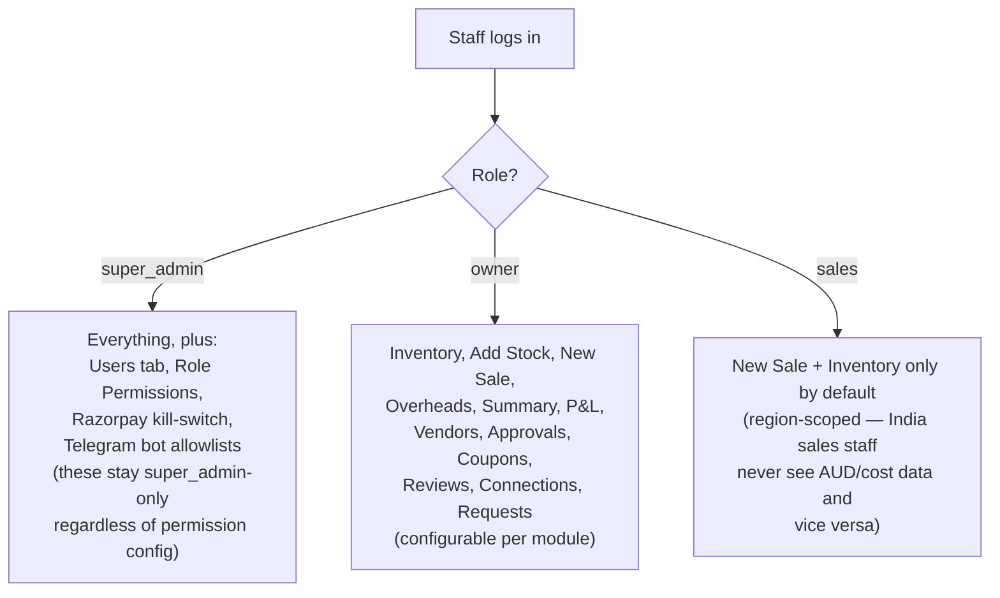

# Admin Panel Role Gating

What `super_admin`, `owner`, and `sales` can each see and do inside `admin.html`, and how
that's enforced.

## How it's enforced

- Every tab/module in `admin.html` has an id (`home`, `inv`, `stock`, `sale`, `sum`, `pnl`,
  `vend`, `appr`, `coup`, `rev`, `usr`, `conn`, `req`, …). Which modules each role can see
  is a configurable list per role, stored in `settings` — a super_admin can adjust this
  through a permissions grid in the UI without any code change.
- **A few things are hardcoded to `super_admin` regardless of that configurable list** —
  the Users tab, the Role Permissions editor itself, the Razorpay enable/disable
  kill-switch, and the Telegram bot chat-allowlists. These can't be delegated down to
  `owner` even if someone tried to configure it that way.
- **`sales` has the narrowest default footprint** — New Sale and Inventory only. Within
  Inventory, a `sales` login scoped to one region only ever sees that region's currency and
  never sees cost price, margins, or P&L figures at all — those fields are simply absent
  from what that login is shown, not just hidden by a UI toggle.
- **Ownership of specific records matters too, not just role.** For some data (e.g. a
  sales-tab's own entered sales), a `sales` login only sees records it created itself, while
  `owner`/`super_admin` see everything.
- **Deleting things** (e.g. removing an inventory item, deleting an expense) is generally
  restricted to `owner`/`super_admin` — `sales` logins can create and view, but not delete,
  most records.

This mirrors the chatbot's own role tiers directly: `super_admin` → this `admin/` tier,
`owner` → the `owner/` tier, `sales` → the `sales/` tier. The chatbot's access boundaries
are a close match to what each role already sees inside `admin.html` itself.
