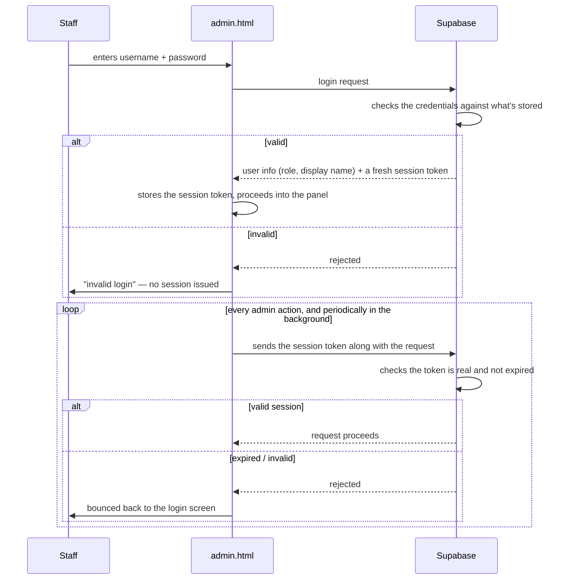

# Staff Auth / Session Flow

Covers how a staff member logs into `admin.html` and how that login stays (or stops being)
valid — at the shape level. The exact hashing/comparison mechanics are deliberately not
reproduced here (see `CURATION_NOTES.md` for why); this describes behavior, not
implementation.

## Key behavioral facts

- **Every sensitive admin action requires a valid session**, not just the initial page
  load — `admin.html` attaches the session token to every call, and the backend checks it
  on every one of them, not just at login time.
- **Sessions expire.** A session issued at login is valid for a fixed window; after that,
  the same token stops working and the user is sent back to the login screen, not silently
  kept logged in.
- **`admin.html` also re-checks periodically in the background** (every few minutes) even
  if the user hasn't clicked anything, so a session that expired mid-use gets caught
  reasonably quickly rather than only on the next action.
- **Automated callers (Edge Functions, scheduled jobs) don't go through this at all** —
  they authenticate to the database a different way (as a trusted backend caller, not as a
  logged-in human), so the Telegram bots and scheduled digests work independently of any
  staff member being logged into `admin.html`.
- **No password is ever stored, logged, or transmitted in a directly-readable form** —
  what's compared at login time is a one-way-derived value, not the password itself. The
  specific algorithm used for that isn't detailed here (see the curation rule).

## Login activity logging

Every login attempt (success or failure) is logged with the IP address and a rough
geographic location, so unusual login activity (wrong time zone, repeated failures) is
visible. A recurring digest reports this activity to the owner-facing monitoring bot only —
never to staff's own chat — so staff aren't alarmed by routine login noise, but someone is
still watching for anomalies.
