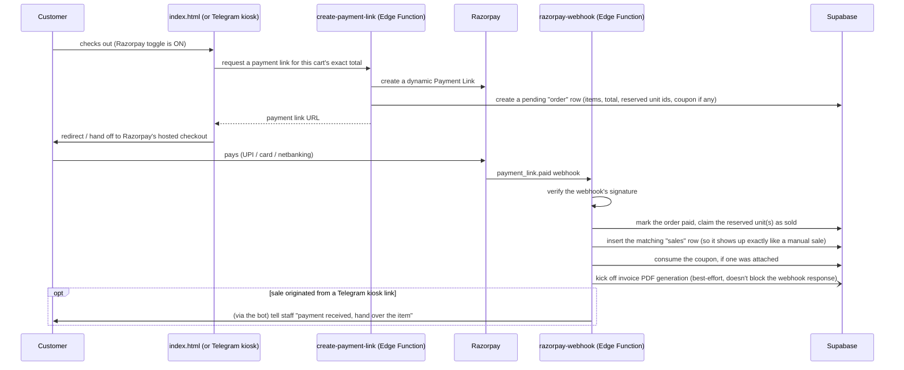

# Checkout / Payment Flow

Two genuinely different checkout paths exist, split by market — there is no online payment
integration for Australia today.

## India — Razorpay (when enabled) or WhatsApp fallback

If the Razorpay toggle is **off**, or a customer is browsing the India storefront without
completing online payment, checkout instead builds a pre-filled WhatsApp message (items,
prices, customer info) and hands off to WhatsApp — the owner then confirms/arranges payment
manually.

## Australia — WhatsApp only, always

Australia has no payment gateway integration. Every Australian checkout — storefront or
kiosk — ends the same way: a pre-filled WhatsApp enquiry message to the Australia WhatsApp
number, with Meenakshi handling payment and fulfillment manually from there.

## Why the webhook matters

The webhook (`razorpay-webhook`) is the **only** place that actually knows a payment
landed — a kiosk-generated Razorpay link doesn't finalize anything in the bot itself; staff
just send the link and move on. Until the webhook fires, the order sits in a pending state
and no `sales` row exists yet. The webhook is idempotent by design (Razorpay can and does
retry webhook delivery) — it checks whether the order is already marked paid before doing
anything, so a duplicate delivery doesn't double-record a sale.

## Price integrity

The price a customer actually pays is the server-side total computed at payment-link creation
time, not anything editable in the browser — `create-payment-link` recomputes it from
`inventory_skus.sale_price` for each unit in the cart, and re-validates any coupon through the
same `validate_coupon` function the storefront itself calls. The client's own total figure is
never read.

This wasn't always true. Until 2026-10-04, the function took the browser-submitted total
directly and only re-checked stock availability, not price — a customer could have edited the
total in dev tools before clicking "Pay" and been charged less than the real cart value. Found
and fixed the same day, verified live against a real SKU before being considered closed. Noted
here because it's a useful example of the general principle: anything the browser sends is an
input to double-check, not a fact to trust, for any flow that moves real money.
