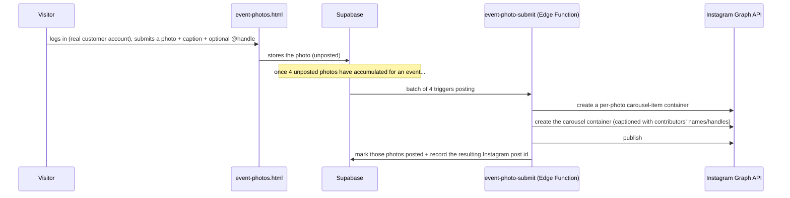

# Instagram / Social Integration

Two separate Instagram-related flows exist today.

## 1. Event-photo auto-posting

This only works once Instagram Graph API access is actually set up (Business/Creator
account linked to a Facebook Page, a Meta Developer App, a long-lived access token) — the
code path is fully built, but silently does nothing until those credentials exist. See
`INSTAGRAM_INSIGHTS_SETUP.md` in this knowledge base for the setup steps.

## 2. Instagram-linked checkout ("Insta link" / "Insta checkout-link")

A separate, simpler flow: staff (via the India bot or `admin.html`) generate a direct
`meensha.in/index.html?buy=<sku_id>` link for a single item, meant to be pasted into an
Instagram post/story/bio-link. Tapping it auto-adds that exact item to the visitor's cart
and opens checkout immediately — no payment link is pre-created, and no placeholder
customer record is needed, since the real buyer's details only show up once they actually
start checking out.

## What's shared between the two

Both flows exist because Instagram is a major sales channel for Meensha, but neither
depends on the other — auto-posting needs the Graph API setup above; the checkout-link
flow works today with zero extra setup (it's just a URL with a query parameter and an
existing cart-loading code path).
