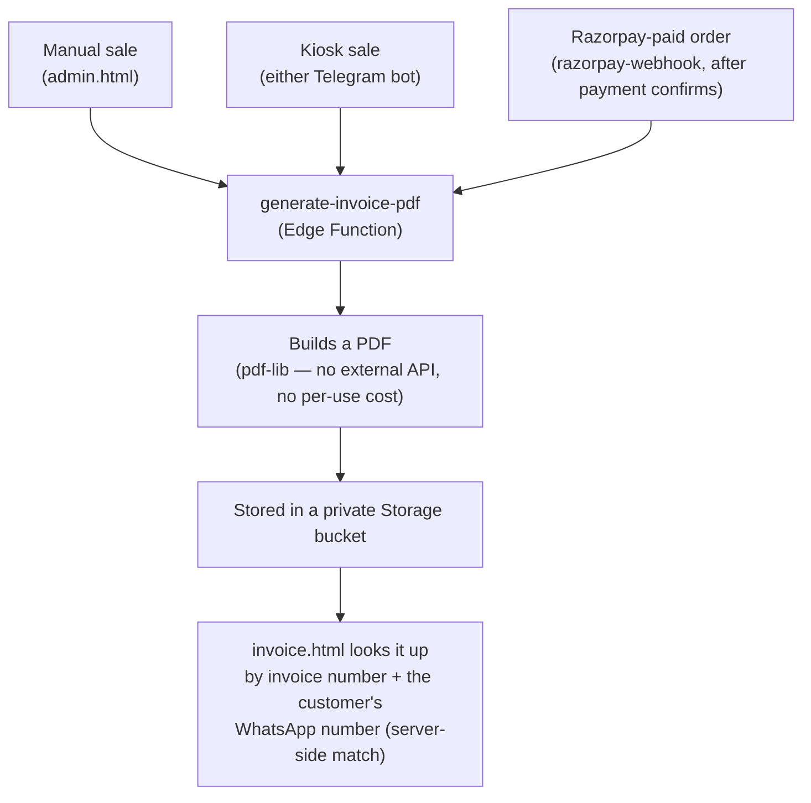

# Invoice Generation

Every completed sale, however it was made, ends up with a branded PDF invoice.

## Why it's built this way

- **Called from all four sale-creation paths** (admin manual entry, India bot, Australia
  bot, the Razorpay webhook) so every sale — regardless of channel — gets the same invoice
  treatment, rather than each path building its own.
- **A PDF failure never blocks the sale.** Invoice generation is explicitly best-effort —
  if it fails for any reason, the sale itself is still recorded; nothing about recording a
  sale depends on the PDF succeeding.
- **Uses a free, no-API-key PDF library** (`pdf-lib`, runs inside the Edge Function itself)
  rather than a paid invoicing/PDF service, consistent with the project's overall
  no-recurring-cost constraint.
- **Lookup is WhatsApp-number-gated, not public.** `invoice.html?invoice=<inv>` requires the
  looker-up to also supply the WhatsApp number on the sale, and that match happens
  server-side — a wrong number returns "not found" rather than the invoice.
- **Regenerable**: if a sale's details are corrected after the fact (a discount applied
  retroactively, a data-entry fix), the cached PDF is cleared so the next lookup regenerates
  it from the corrected sale data rather than serving a stale PDF.
