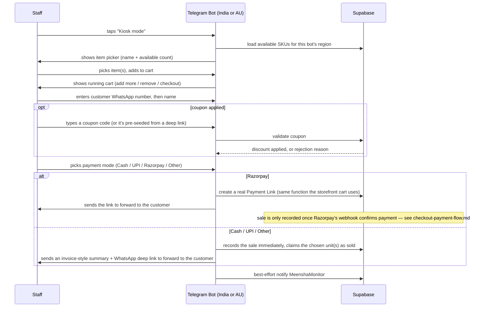

# Kiosk Sale Flow (Telegram Bots)

Both regional bots have a "Kiosk mode" — the flow staff use to record a sale on the spot
(at a pop-up stall, or any in-person transaction) without opening a laptop.

## Key details

- **Persistent, not one-shot**: after a sale, Kiosk mode loops back to the item picker
  instead of resetting to the idle menu — built this way because staff typically ring up
  several sales back-to-back.
- **Stock check happens live**: picking an item shows its real current available count, and
  the bot won't let a sale proceed past what's actually in stock.
- **The unit, not just the SKU, gets claimed**: a sale picks (or the system assigns) a
  specific physical unit, which is what actually gets marked `sold` — this is what prevents
  two staff members, or a staff member and the storefront, from selling the same physical
  piece twice.
- **Cash/UPI/Other sales write to `sales` immediately.** Razorpay-mode kiosk sales do
  **not** — the bot only generates and sends a payment link; the sale itself isn't recorded
  until Razorpay confirms the payment (see `checkout-payment-flow.md`). This matters if
  you're reconciling "why isn't this sale showing yet" — an unpaid Razorpay link from the
  kiosk simply hasn't resulted in a sale yet.
- **Invoice delivery**: for non-Razorpay sales, the bot builds the invoice text itself and
  hands staff a ready-to-send WhatsApp link; for Razorpay sales, the real branded PDF
  invoice (see `invoice-generation.md`) is what eventually reaches the customer once payment
  lands.
- **Region scoping**: the India bot only shows India-available stock/pricing; the Australia
  bot only shows Australia-available stock/pricing (in AUD). Each SKU carries its own
  per-region availability flag.
