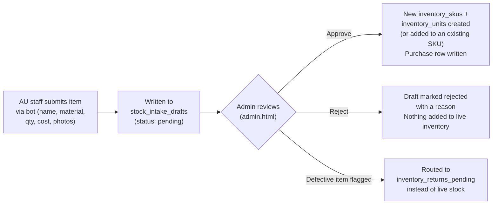

# Stock Intake / Approval Flow

New inventory can enter the system two ways, depending on who's adding it and how much
trust that path has by default.

## Direct entry (admin.html, or India bot's "Enter inventory")

Staff pick a vendor, enter item details (name, material, variant, cost, quantity), upload
photos, get an AI-suggested retail price (optional), and the new SKU + physical units are
created immediately — no review step. This is the original, simpler path, and it's still
how most India-side stock gets entered.

## Draft-first intake (Australia bot's "Stock intake")

This is a deliberate trust boundary, not an oversight: a draft submission **never touches
live inventory** until someone with admin access reviews and approves it. The reasoning
(from the original build decision): Australia-side stock entry happens further from direct
oversight, so an extra review step was worth the friction.

Two related but distinct approval paths exist in the database, both reachable from
`admin.html`'s pending-intake screen:
- Approving a **single draft** — creates (or adds units to) one SKU.
- Approving a whole **purchase batch** at once — processes every pending draft tied to the
  same vendor/purchase together, splitting out any defective-flagged items into the returns
  queue instead of adding them to sellable stock.

## Vendor returns

Separately, a physical unit can be marked `returned_to_vendor` (from `admin.html`'s
inventory screen, or flagged during intake as defective) — this records the return and its
refunded/deducted amount in `purchase_returns`, which P&L calculations subtract from cost of
goods so a return doesn't overstate what the business actually spent on units it sent back.
